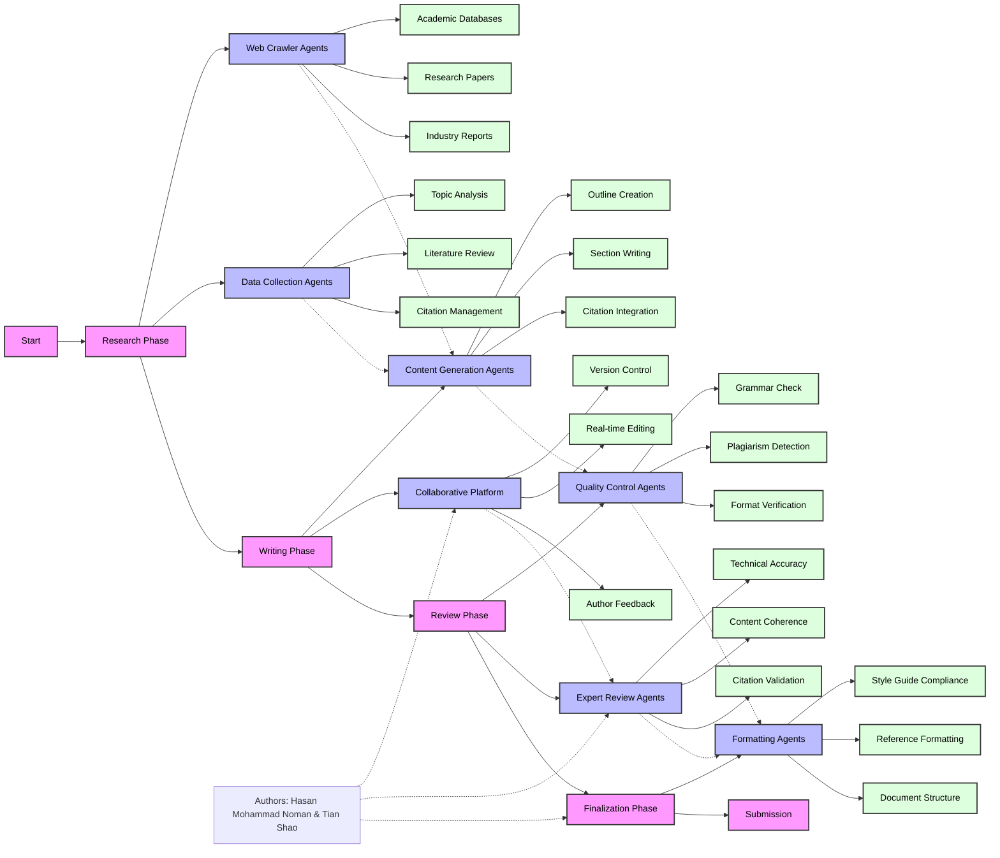

# Paper Writing Process Flowchart: "Leading AI Agents: From Delegation to Orchestration"

## Process Description

1. **Research Phase**
   - Web crawler agents gather relevant information from various sources
   - Data collection agents organize and analyze the gathered information
   - Initial literature review and citation management

2. **Writing Phase**
   - Content generation agents create the paper structure and content
   - Collaborative platform enables real-time editing and author feedback
   - Integration of research findings and citations

3. **Review Phase**
   - Quality control agents ensure technical accuracy and formatting
   - Expert review agents verify content coherence and citations
   - Multiple rounds of review and revision

4. **Finalization Phase**
   - Formatting agents ensure compliance with style guides
   - Final review and approval by authors
   - Preparation for submission

## Key Features

- **Agent Network**: Multiple specialized AI agents working in coordination
- **Collaborative Platform**: Real-time editing and feedback system
- **Quality Assurance**: Multiple layers of review and verification
- **Author Oversight**: Continuous involvement of human authors
- **Automated Tools**: Integration of various writing and research tools 